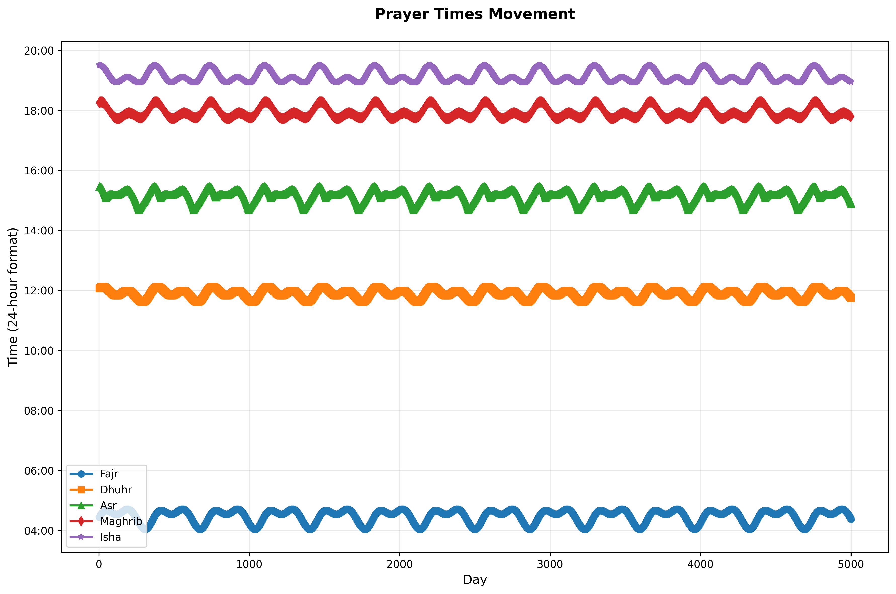
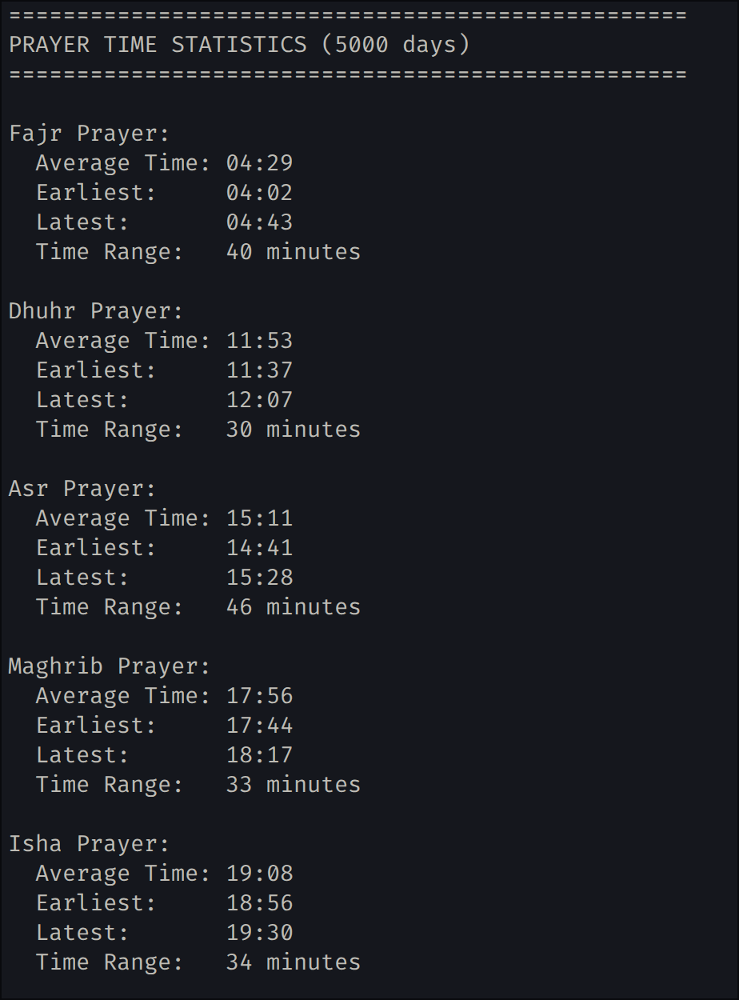

# Prayer Times Graph Maker

A Python script that calculates Islamic prayer times, idk why i even make this, i'm just curious what is the max and min time of prayer time, that's it.






## Installation

1. Clone or download this repository.

2. Create a virtual environment (recommended):
   ```bash
   python3 -m venv venv
   source venv/bin/activate  # On Windows: venv\Scripts\activate
   ```

3. Install the required dependencies:
   ```bash
   pip install -r requirements.txt
   ```

## Usage

Run the script from the project directory:

```bash
python main.py
```

The script will:
1. Calculate prayer times for Jakarta starting from today
2. Display statistical summaries for each prayer
3. Generate and save a graph as `prayer_times_graph.png`
4. Display the graph (if running in an environment that supports GUI)

## Output

- **Console Output**: Statistics for each prayer time including average, earliest, latest, and time range
- **Graph File**: `prayer_times_graph.png` - A line plot showing how each prayer time varies over the days

## Dependencies

- `adhanpy==1.0.5` - For Islamic prayer time calculations
- `matplotlib==3.10.8` - For plotting the graphs

## Configuration

You can modify the following parameters in `main.py`:

- `location`: Coordinates for Jakarta 
- `zone`: Time zone (default: "Asia/Jakarta")
- `num_days`: Number of days to track (default: 5000)
- `CalculationMethod`: Prayer calculation method (default: SINGAPORE)